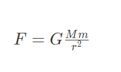
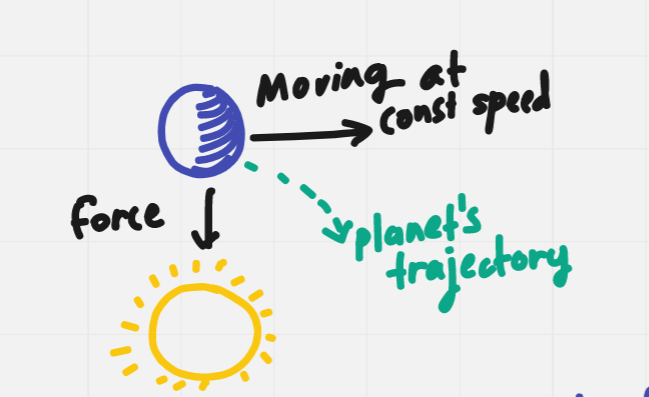
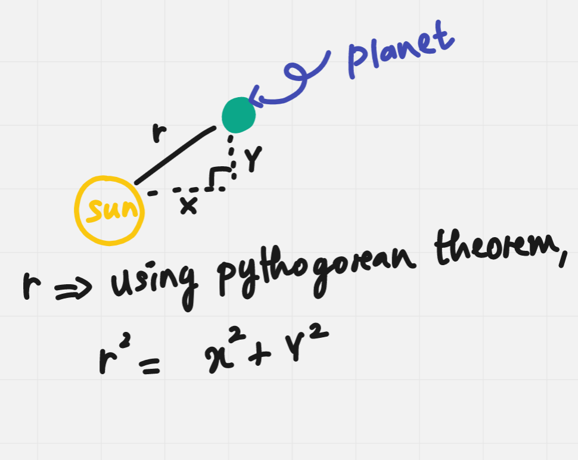
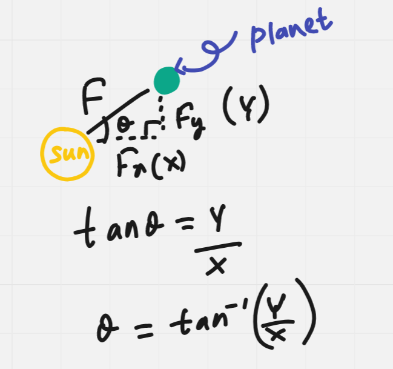
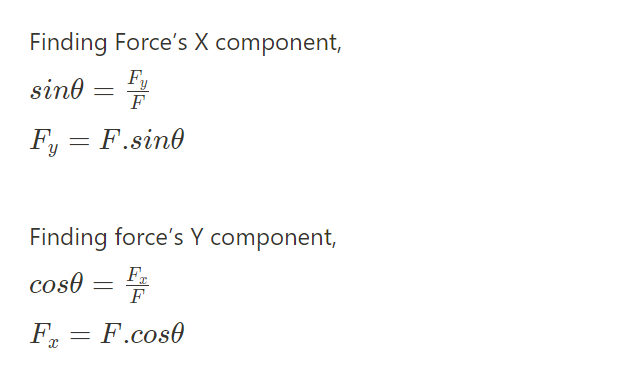

# Force of Attraction
- Know that gravity is relative to different objects
- All the objects are attracting one another, and the force of this attraction depends on their masses.
- This relationship is given by the equation, (Force of attraction between two objects)

    

    - By examining it you can see, the distance between them affects this force more than their masses.
    - The further away these masses are the lower the attraction will be. And wise versa.

# Explaining how planets get their movements
- Planets are moving at a constant speed
- They are also being pulled towards the sun by the force of attraction (
- Therefore, their trajectory is a result of both those components, causing the planet to move around the sun
- But why doesn’t the planet shoot towards the sun by that force of gravity?
    - because the planet already has a momentum towards another direction
    
    
    
 
    
 but also…

- But there are other planets too, that are orbiting around sun
- All these planets have their own forces of attractions towards each other
- That’s why planets have different orbits and different speeds, based on their location.

# Calculating R

# Calculating Fx and Fy
First we need to calculate the angle

